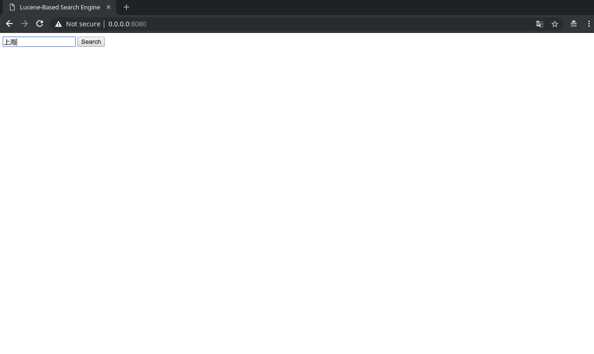
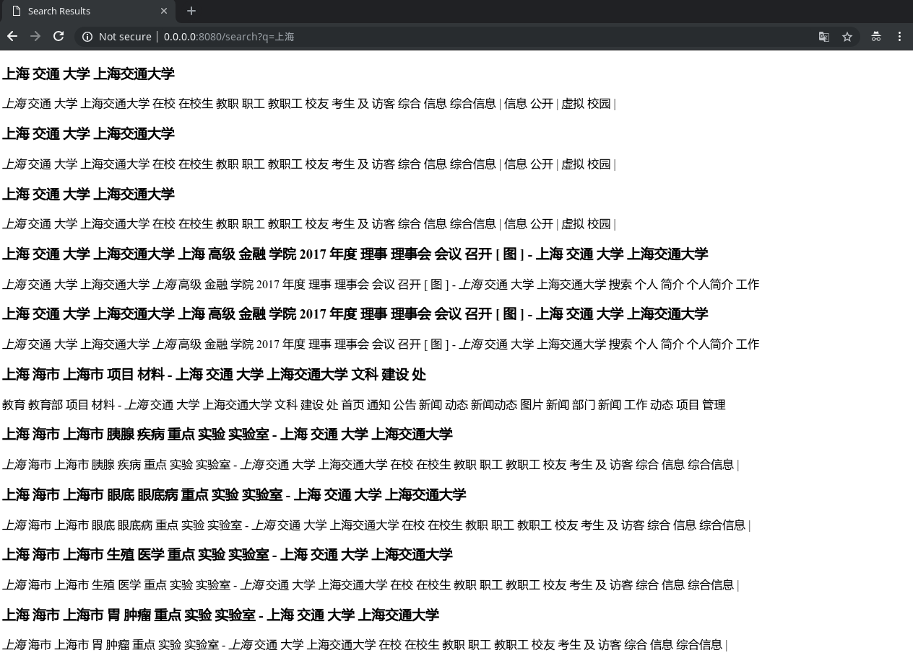

# Lab Report 7

517030910384 徐尚宁

## Introduction

Built on previous efforts, we can now get our hands on building a real "web" search engine (by "web" we mean "accessed through internet"). In this report, we would like to present a barebone web search engine that can perform web and image searches. First, we introduce the process of  integrating web.py, and explain the reasons why we eventually abandoned it. Then, we replace web.py with Flask, a micro web framework. Finally, a series of screenshots and code snippets are showcased .

## Environment Setup

Since the stable version of web.py doesn't support Python 3 yet, and the latest development version 0.40-dev1 has a serious bug in Python 3.7 (fixed in [9d9eeef](https://github.com/webpy/webpy/commit/9d9eeef75dc34f62572c68e90093574a44207e1f)), the bleeding-edge version on GitHub is fetched. Simply enter the fetched directory and run

```bash
$ python setup.py build
$ sudo python setup.py install
```

and then web.py is installed.

## Using web.py

### Backend

All backend code is stored in the file `server.py`. The first few lines define the routes, a renderer and a form helper:

```python
# all the routes
urls = (
    '/', 'Index',
    '/search', 'Search',
    '/image', 'Image'
)
# the renderer. The optional parameter base specifies the template
# from which all other templates should inherit. The value "base"
# represents the template "base.html"
render = web.template.render('templates/', base='base')

# A form helper defined for the search query. The form only has one
# element: a textbox for entering query, which must not be null.
search_box = web.form.Form(web.form.Textbox('q', web.form.notnull))
```

The class `Index` controls the rendering of the index page:

```python
class Index:
    def GET(self):
        return render.index()
```

It renders the `index.html` file.

The class `Search` handles web search. It can be divided into three parts, as indicated in the following snippet:

```python
class Search:
    def GET(self):
# 1. Validate the form
        search_box_copy = search_box()
        if search_box_copy.validates():

# 2. Searching the index
            lucene.getVMEnv().attachCurrentThread()
            directory = SimpleFSDirectory(File('index/webpages/').toPath())
            searcher = IndexSearcher(DirectoryReader.open(directory))
            analyzer = WhitespaceAnalyzer()

            # In later version of Lucene, BooleanQuery becomes immutable and can
            # only be constructed by BooleanQuery.Builder
            query_builder = BooleanQuery.Builder()
            # get the user's query
            user_query = search_box_copy['q'].value
            # parse user's query into a dictionary
            query_dict = parse_query(user_query)
            # "default" in query_dict corresponds to queries without fields.
            if query_dict.get('default') is not None:
                terms = ' '.join(jieba.cut(query_dict['default']))
                # search over "content" and "title' fields
                query = QueryParser('content', analyzer).parse(terms)
                query_builder.add(query, BooleanClause.Occur.SHOULD)
                query = QueryParser('title', analyzer).parse(terms)
                query_builder.add(query, BooleanClause.Occur.SHOULD)
            if query_dict.get('site') is not None:
                # use TermQuery because we expect an exact match
                query_builder.add(TermQuery(Term('site', query_dict['site'])),
                                  BooleanClause.Occur.MUST)

# 3. Build a result set for rendering the template

            # build a BooleanQuery object and pass it to searcher
            # retrieve the top 10 hits
            final_query = query_builder.build()
            score_docs = searcher.search(final_query, 10).scoreDocs
            results = []    # the result set for rendering the template
            for score_doc in score_docs:
                # retrieve the document
                doc = searcher.doc(score_doc.doc)
                # read and cut the original text
                with open('crawled/text/' + doc.get('filename')) as f:
                    text = ' '.join(jieba.cut_for_search(f.read()))

                # HTML formatter applies HTML markups to highlighted terms
                html_formatter = SimpleHTMLFormatter('<em>', '</em>')
                # Highlighter determines which parts of a document should be highlighted
                # and the context of the highlighte term to return.
                highlighter = Highlighter(html_formatter, QueryScorer(final_query))
                index_reader = searcher.getIndexReader()
                token_stream = TokenSources.getTokenStream(
                    'content', index_reader.getTermVectors(score_doc.doc),
                    text, analyzer,
                    highlighter.getMaxDocCharsToAnalyze() - 1
                )
                # get the best fragment to display in search results
                frag = highlighter.getBestFragment(token_stream, text)
                # append the title of the webpage and the text fragment to the result set
                results.append((doc.get('title'), frag))
            return render.search(results)
        else:
            raise web.notfound()
```

The same can be said of the `Image` class, which handles image search:

```python
class Image:
    def GET(self):
# 1. Validate the form
        search_box_copy = search_box()
        if search_box_copy.validates():
# 2. Searching the index
            lucene.getVMEnv().attachCurrentThread()
            directory = SimpleFSDirectory(File('index/images/').toPath())
            searcher = IndexSearcher(DirectoryReader.open(directory))
            analyzer = WhitespaceAnalyzer()

            user_query = search_box_copy['q'].value
            query = QueryParser('description', analyzer).parse(
                ' '.join(jieba.cut(user_query)))
            top_docs = searcher.search(query, 10).scoreDocs

# 3. Build a result set for rendering the template
            results = []
            for score_doc in top_docs:
                doc = searcher.doc(score_doc.doc)
                results.append((doc.get('url'), doc.get('description'), doc.get('origin')))
            return str(results)
        else:
            raise web.notfound()
```

Note that to search the index, the JVM must be attached to the current thread. In Python 2, this can be done with

```python
# (in the global scope)
vm_env = lucene.initVM(vmargs=['-Djava.awt.headless=true'])
...
# somewhere in the class
vm_env.attachCurrentThread()
```

as `vm_env` is a global variable. However, due to (possibly) different scoping rules in Python 3 between threads, `vm_env` is inaccessible in `GET()` of any class. We should first get the running JVM from Lucene and then attach the thread:

```python
# somewhere in the class
vm_env = lucene.getVMEnv()
vm_env.attachCurrentThread()
```

### Highlighting the Key Terms

The built-in highlight toolset is used to highlight key terms in the text. An HTML formatter is initialised to format the parts to highlight. An index reader instance reads the index. `TokenSources.getTokenStream()` will first try to retrieve the key terms by uninverting the index in `index_reader.getTermVectors(score_doc.doc)`. If the field from which the terms are retrieved has `stored` set to false, such as the "content" field for the webpage in our case, `getTokenStream()` will reanalyze the text (stored in the variable `text`) with `analyzer`. Here are the part associated with the highlighter

```python
for score_doc in score_docs:
    # retrieve the document
    doc = searcher.doc(score_doc.doc)
    # read and cut the original text
    with open('crawled/text/' + doc.get('filename')) as f:
        text = ' '.join(jieba.cut_for_search(f.read()))

    # HTML formatter applies HTML markups to highlighted terms
    html_formatter = SimpleHTMLFormatter('<em>', '</em>')
    # Highlighter determines which parts of a document should be highlighted
    # and the context of the highlighte term to return.
    highlighter = Highlighter(html_formatter, QueryScorer(final_query))
    index_reader = searcher.getIndexReader()
    token_stream = TokenSources.getTokenStream(
        'content', index_reader.getTermVectors(score_doc.doc),
        text, analyzer,
        highlighter.getMaxDocCharsToAnalyze() - 1
    )
    # get the best fragment to display in search results
    frag = highlighter.getBestFragment(token_stream, text)
    # append the title of the webpage and the text fragment to the result set
    results.append((doc.get('title'), frag))
```

## Building a Frontend

The first template we build is `base.html`. It will be inherited by all other templates:

```html
<!-- base.html -->
$def with (html)
<!DOCTYPE html>
<html lang="zh-cn">
<head>
  <meta charset="UTF-8">
  <meta name="viewport" content="width=device-width, initial-scale=1.0">
  <meta http-equiv="X-UA-Compatible" content="ie=edge">
  <title>$html.title</title>
</head>
<body>

$:html

</body>
</html>
```

Templates in web.py works like functions: they accept parameters. `base.html` accepts a parameter `html`, a partial HTML document. The parameter `html` is best explained by presenting the second HTML file, `index.html`:

```html
<!-- index.html -->
<!-- defined the title to show -->
$var title: Lucene-Based Search Engine
<form action="/search" method="get">
  <input name="q" id="q">
  <button type="submit">Search</button>
</form>
```

### Why not `Form.render()`

It should be noted that although we define a form helper `search_box` of class `web.form.Form`, we only use the form helper for validiation, but not rendering. There are two problems with the rendering of a form helper:

1. `web.form.Form` will turn a submit button into an `<input>` field with the `name` attribute. Ideally, a submit button can be an `<input>` with `type="submit"`, but **without** the `name` attribute.
2. `Form.render()` uses old technology for formatting. Using `<table>` to format HTML is the standard before the formation of CSS, but is no longer acceptable.

### Presenting Search Results

The following code is for `search.html`:

```html
$def with (results)
$var title: Search Results
\
$for result in results:
  <div>
    <h3>$result[0]</h3> <!-- webpage title -->
    <p>$:result[1]</p>  <!-- text fragment -->
  </div>
```

### Screenshots

Before moving to the next part, we give a few screenshots of our rough search engine:

Here is the homepage:



Search results:



Highlighted key terms are surrounded with `<em></em>` and by default are italicized. Unfortunately, italicized Chinese characters are barely distinguishable from regular Chinese characters.
